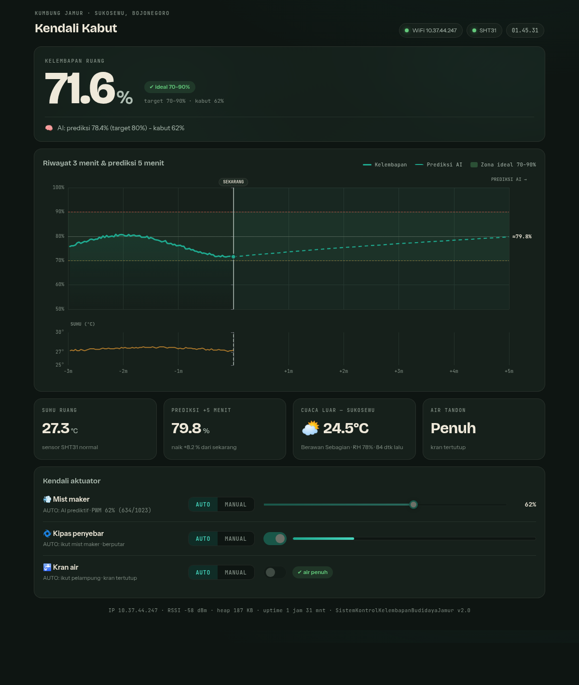

# Sistem Kontrol Kelembapan Budidaya Jamur (ESP32)

Sistem kontrol kelembapan otomatis untuk kumbung jamur berbasis **ESP32 DevKit V1**
dengan **AI predictive control**: kelembapan diramal 5 menit ke depan (model Holt /
double exponential smoothing), lalu PWM mist maker diatur dari *prediksi* — bukan
hanya nilai saat ini — ditambah *feedforward* cuaca luar dari API Open-Meteo.

Dashboard web disajikan langsung dari flash ESP32 (LittleFS): grafik kelembapan
3 menit ke belakang + ramalan 5 menit ke depan dengan garis **SEKARANG** di tengah,
monitoring realtime, dan saklar manual untuk setiap aktuator.



Desain "Kumbung Tengah Malam": latar gelap lumut, angka krem, aksen teal embun,
dengan **lapisan kabut hidup di hero yang kepekatannya mengikuti PWM mist maker**.
Grafik memakai Apache ECharts; font Bricolage Grotesque + Instrument Sans +
JetBrains Mono via Google Fonts (CDN — perangkat yang MEMBUKA dashboard butuh
internet untuk grafik & font; monitoring dan semua kontrol tetap berfungsi tanpa
internet).

## Fitur

- 📈 **Grafik realtime**: riwayat suhu & kelembapan 3 menit (kiri) + prediksi AI 5 menit (kanan), zona ideal 70–90% ditandai.
- 🧠 **AI Predictive Control**: PWM mist dihitung dari selisih prediksi terhadap target 80%.
- 🛡️ **Aturan override** (selalu menang atas AI):
  - RH < 70% → kabut 100%
  - 80–90% → PWM diperlambat linier
  - RH ≥ 90% → kabut **mati** (berlaku juga di mode manual)
- 🌤️ **Cuaca luar** (Open-Meteo, Sukosewu Bojonegoro) sebagai feedforward: makin panas & kering, base PWM naik.
- 🌀 **Fan penyebar kabut** otomatis mengikuti mist (PWM > 0 → fan ON).
- 🚰 **Pengisian air otomatis**: pelampung LOW → valve buka, plus alarm anti-banjir (timeout isi 5 menit).
- 🎛️ **Mode manual** per aktuator dari web (slider PWM mist, saklar fan & kran).
- 📟 **LCD 16x2 I2C**: tampilan setup saat boot, lalu 4 halaman info bergantian.
- 📶 **AP fallback**: WiFi gagal → ESP32 membuka hotspot `JamurControl` (pass `jamur12345`).
- ⛑️ **Fail-safe**: sensor gagal → kabut mati; timeout NTP/cuaca tidak mengganggu kontrol.

## Hardware

| Komponen | Pin ESP32 | Keterangan |
|---|---|---|
| SHT31 (suhu + RH) | SDA 21, SCL 22 | I2C addr `0x44` |
| LCD 16x2 I2C | SDA 21, SCL 22 | addr `0x27`/`0x3F` auto-deteksi |
| Mist maker (PWM) | GPIO 25 | 100 Hz, 10-bit (0–1023) |
| Sensor air penuh (pelampung) | GPIO 26 | `INPUT_PULLUP`, HIGH = penuh |
| Relay valve air | GPIO 19 | HIGH = kran buka |
| Relay fan | GPIO 18 | HIGH = fan nyala |

> Modul relay aktif-LOW? Ubah `RELAY_ON`/`RELAY_OFF` di bagian konfigurasi sketch.

## Konfigurasi board

- Board: **ESP32 Dev Module** (DevKit V1), flash 4MB
- Partition Scheme: **Huge APP (3MB No OTA/1MB SPIFFS)** — filesystem dipakai sebagai LittleFS
- WiFi: SSID `robot`, password `12345678` (ubah di bagian atas sketch)

Library (Library Manager): `ArduinoJson` (v7), `Adafruit SHT31 Library`, `LiquidCrystal I2C`.

## Build & upload lewat arduino-cli

```bash
FQBN="esp32:esp32:esp32:PartitionScheme=huge_app"

# 1) compile + upload firmware
arduino-cli compile --fqbn "$FQBN" --output-dir build SistemKontrolKelembapanBudidayaJamur
arduino-cli upload  --fqbn "$FQBN" --input-dir build -p /dev/ttyUSB0 SistemKontrolKelembapanBudidayaJamur

# 2) buat & flash image LittleFS (dashboard web) — offset partisi huge_app: 0x310000
mklittlefs -c SistemKontrolKelembapanBudidayaJamur/data -p 256 -b 4096 -s 917504 build/littlefs.bin
esptool --chip esp32 --port /dev/ttyUSB0 --baud 460800 write_flash 0x310000 build/littlefs.bin
```

Atau jalankan `./upload.sh` (mengerjakan semua langkah di atas).

Dari Arduino IDE: upload sketch biasa + plugin *LittleFS Data Upload* untuk folder `data/`.

Isi folder `data/` (dashboard, disajikan dari LittleFS):

```
data/
├── index.html   # struktur halaman
├── style.css    # tema "Kumbung Tengah Malam" + kabut hidup
└── app.js       # poll API 2 dtk, grafik ECharts, kontrol aktuator
```

## Cara pakai

1. Nyalakan alat — LCD menampilkan proses setup (sensor, WiFi, web server, IP).
2. Buka **http://bagus.local** dari browser (HP/laptop satu jaringan WiFi).
   Bila `.local` tidak terbuka (sebagian HP Android), pakai IP yang tampil
   bergantian di LCD halaman jaringan.
3. Dashboard menampilkan grafik, status semua aktuator, cuaca luar, dan keputusan AI.
4. Geser mode ke **MANUAL** bila ingin mengendalikan mist/fan/kran sendiri —
   safety RH ≥ 90% tetap aktif.

## API

| Endpoint | Metode | Fungsi |
|---|---|---|
| `/` | GET | Dashboard (LittleFS) |
| `/api/data` | GET | JSON: sensor, riwayat 3 mnt, prediksi 5 mnt, cuaca, status aktuator |
| `/api/control?dev=mist&mode=manual&val=60` | POST | Mode/nilai aktuator (`mist`,`fan`,`valve`) |
| `/api/control?dev=alarm` | POST | Reset alarm pengisian air |

## Cara kerja AI

1. SHT31 dibaca tiap 2 detik → buffer ring 90 titik (3 menit).
2. **Holt double exponential smoothing** (α=0.30, β=0.05) memodelkan level + tren kelembapan.
3. Ramalan `RH(t+Δ) = level + tren·Δ` dihitung sampai +5 menit (ditampilkan di grafik)
   dan +2 menit (dipakai kontroler).
4. Kontroler prediktif: `PWM = feedforward_cuaca + Kp·(80 − RH_prediksi)`,
   dibatasi aturan override di atas + slew-rate agar halus.
